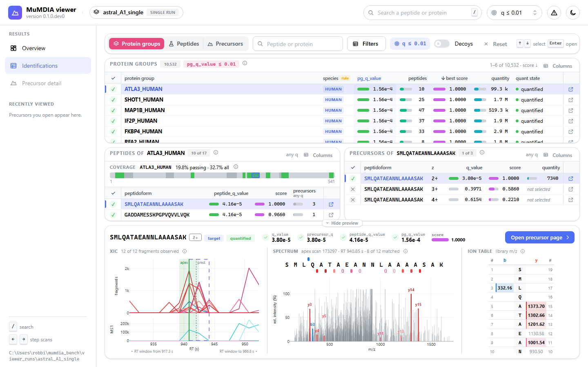
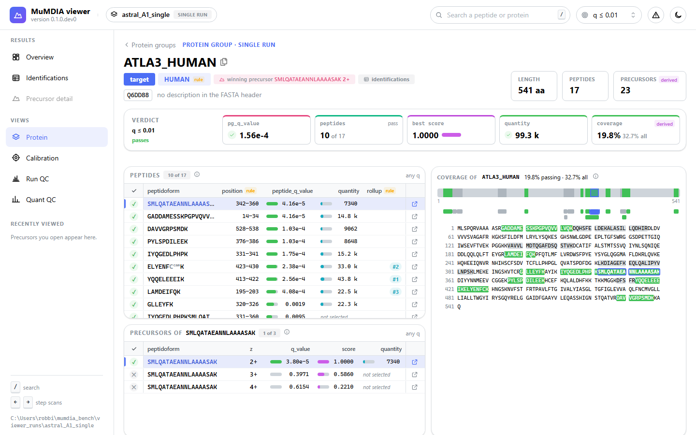
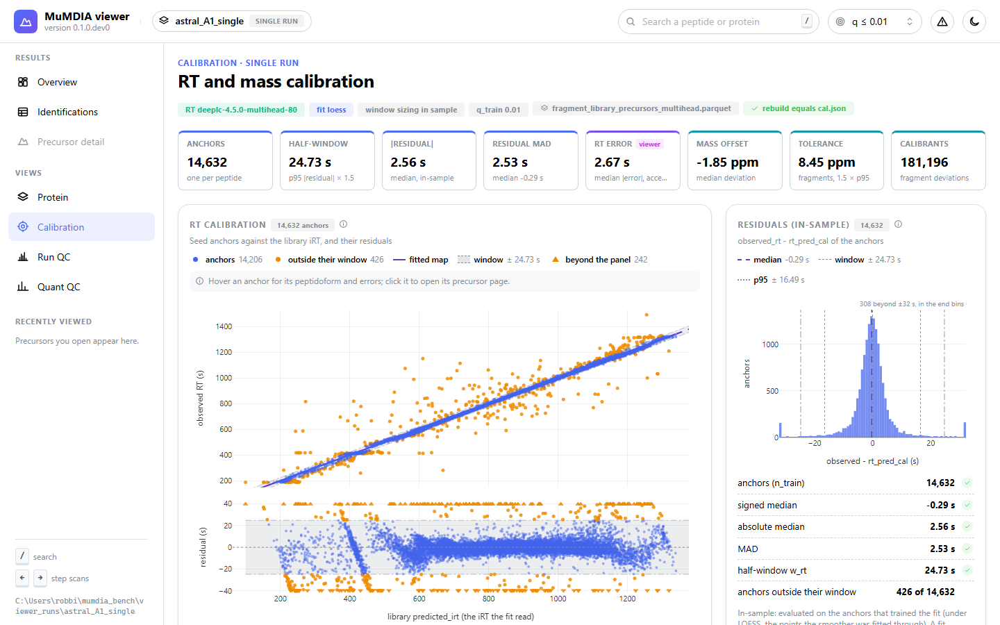
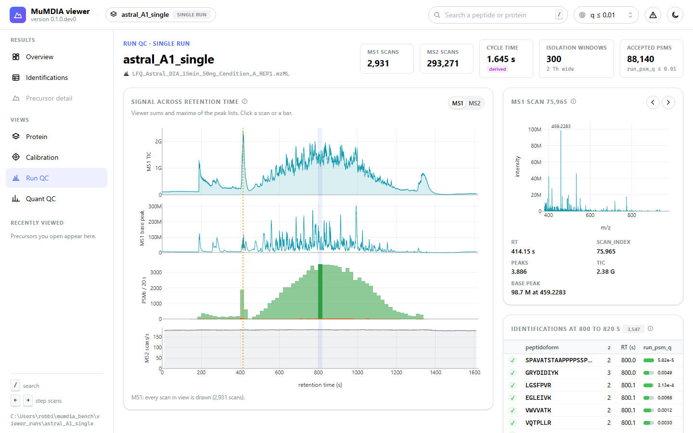
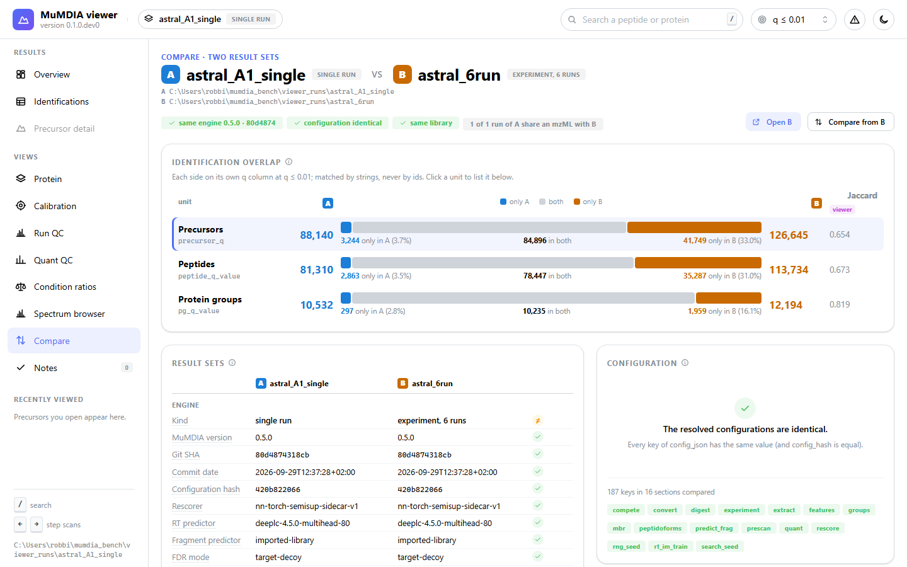

# visDIA: MuMDIA results viewer

`mumdia-viewer` is an interactive, read-only viewer for the outputs of
[MuMDIA](https://github.com/CompOmics/MuMDIA), a DIA proteomics search engine.
It opens a run or an experiment directory and shows the identifications, the
evidence behind each one (XICs, spectra, decoy competition), the calibrations,
the quantification, and the differences between two result sets.

Status: all views of the specification are built: the run overview, the
identification browser and the precursor detail (P0); calibration, run QC, quant QC
and the protein view (P1); experiment views, compare, the spectrum browser, export and
validation notes (P2). The viewer reads MuMDIA v0.5.0 outputs, and the schema versions
of earlier releases. It never writes to a run directory.



## Install

```bash
pip install .                     # or the wheel: pip install mumdia_viewer-*.whl
```

## Install (development)

```bash
python -m venv .venv
.venv/Scripts/activate            # Windows; use `source .venv/bin/activate` elsewhere
pip install -e ".[dev]"
```

Python 3.11 or newer.

## Run the viewer

```bash
mumdia-viewer <run-or-experiment-dir> [--fasta <proteins.fasta>] [--compare <other-dir>] [--port N]
```

The viewer serves at `http://127.0.0.1:<port>/<token>/` and opens a browser. The random
token in the address keeps other users of a shared machine out.

- **FASTA:** `--fasta` gives the protein sequences for the coverage views. A run searched
  directly from a FASTA records it, and the viewer then finds it without the option.
- **Remote server:** start it there with `--no-browser`, then forward the port:
  `ssh -L <port>:127.0.0.1:<port> <user>@<server>`. Open the printed address on your
  machine.
- **Inputs that moved:** `--remap OLD=NEW` says where inputs recorded under `OLD` are
  now.

The [user guide](docs/user-guide.md) describes every page, the options, where the viewer
keeps its files, and how to solve common problems.

| | |
|---|---|
|  |  |
|  |  |

Every number is MuMDIA's own column. A number the viewer derives (a percentile, a
coverage, a CV, a viewer-side spectrum match) says so where it is shown.

## The data layer

`mumdia_viewer.data` is a plain Python API that returns pandas DataFrames, numpy arrays
and dataclasses, for use in a notebook or another application:

```python
from mumdia_viewer.runtime import configure_environment
configure_environment()                      # before numpy/pyarrow: bounded threads and memory

from mumdia_viewer.data import open_results
from mumdia_viewer.data import counts, tables
from mumdia_viewer.data.detail import precursor_detail, mirror

rs = open_results("path/to/run-or-experiment")
for c in counts.unit_counts(rs, 0.01):
    print(c.label)                           # e.g. "81,310 peptides (unique base_peptide_id, peptide_q_value <= 0.01)"

page = tables.identification_table(rs, tables.TableQuery(unit="precursor", limit=20))
detail = precursor_detail(rs, rs.runs[0], int(page.rows.candidate_id.iloc[0]))
spectrum = mirror(rs, detail)                # apex MS2 scan against the predicted fragments
```

See [docs/data-layer.md](docs/data-layer.md) for how artifacts are found, versioned,
cached and counted.

## Tests

```bash
pytest                                        # hermetic tests on tests/fixtures
MUMDIA_VIEWER_REAL_SINGLE=<run dir> MUMDIA_VIEWER_REAL_EXPERIMENT=<experiment dir> pytest -m real_data
python benchmarks/m1_performance.py <run dir> # open, precursor detail and memory, cold and warm
python benchmarks/m2_ui_performance.py <run dir> # server time of the pages, cold and warm
```

The UI tests build the pages on the fixtures without a browser. Some also drive headless
Chromium through Playwright when it is installed (`pip install -e ".[dev]"`, then
`playwright install chromium`).

Licence: Apache-2.0.
